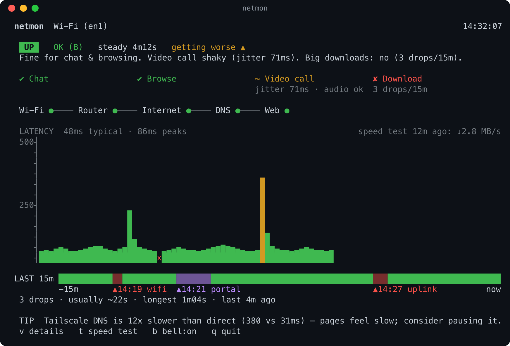

# netmon

A terminal dashboard for the one question that matters when the connection gets flaky: **is it the network, or is it me?** `netmon` pings the gateway and the internet every second, cross-checks with HTTP/HTTPS/DNS, and turns that into a state you can read in one glance — plus how long drops tend to last on this network, and whether chat, browsing, a video call, or a big download will actually work right now.

It is built for any link you don't control: home and office Wi-Fi, hotel and café networks, a phone tether, and in-flight Wi-Fi — the captive-portal-gated, drop-every-few-minutes kind of connection that motivated it in the first place.

<p align="center">
  
</p>
<p align="center"><sub>The default simple view (mock data). Press <code>v</code> for the advanced view with every number.</sub></p>

## Requirements

- macOS (uses `ping`, `route`, `scutil`, `networksetup`, `ipconfig`, `system_profiler`, `dig`, `curl`, `netstat` — all read-only, no admin rights — plus `open` for the `o` key)
- [Bun](https://bun.sh) 1.4+
- No install step, no `sudo`, zero runtime dependencies. Never changes network settings.

## Run it

```
bun start
# or
bun run src/main.ts
```

Quit with `q` or Ctrl-C — either way it prints a one-screen summary of the session to your scrollback before exiting.

## CLI flags

```
--target <ip>        internet ping/route target (default 1.1.1.1)
--iface <name>       force the Wi-Fi interface (default: networksetup lookup)
--log [path]         write JSONL (default path ~/netmon-YYYYMMDD-HHMM.jsonl)
--portal-url <url>   URL for the o key when no redirect was captured
--plain              one status line per second, no full-screen UI
--advanced           start in the detailed view (default: the simple view)
--ascii              ASCII glyphs instead of Unicode
--no-color           no ANSI colors (NO_COLOR env also respected)
--no-bell            start with the bell off
--help
```

## Keys

| Key | Does |
|---|---|
| `q`, Ctrl-C | quit (prints the summary report) |
| `t` | run a 250 KB speed test — refused while the connection isn't UP/DEGRADED, and rate-limited to once per 30s |
| `b` | toggle the terminal bell on/off |
| `o` | open the captive-portal login page in your default browser |
| `v` | switch between the simple view and the advanced (detailed) view |

## Reading the screen

netmon opens in the **simple view**: a colored state badge with a one-sentence summary, the four activity verdicts as colored chips, the hop path as a chain of colored dots (✔/~/✘ with `--no-color`), a latency chart of the last 60 pings (bars green/yellow/red by quality, `x` = lost) captioned with the last speed-test result when there's room, the 15-minute timeline with a one-line drop summary, and the tip line. Press `v` (or start with `--advanced`) for the **advanced view** described below, with every number.

### State & grade

Top line: a colored state word, a letter grade, and how long it's been stable (or how long it's been down), followed by a one-sentence plain-English summary of what will and won't work. In the advanced view a header above it shows the egress interface, gateway, DNS server (`(ts)` when it's Tailscale's), probe traffic so far, the clock, and run time.

- **UP** — everything's working. **DEGRADED** — up but hurting (bad DNS, failing web requests, or just poor quality). **DOWN** — no internet; the cause is one of `wifi` (weak/lost signal), `router` (can't reach the gateway), or `uplink` (gateway's fine, the upstream link isn't). **PORTAL** — you're connected but logged out of the network's captive portal; press `o`. **NO LINK** — not joined to Wi-Fi, or joined but no DHCP address yet. **WARMUP** — just started, still taking its first measurements.
- **Grade A–D**, from loss/latency/jitter over the last 60s: **A (GOOD)** — great. **B (OK)** — fine for chat and browsing. **C (POOR)** — chat works, pages crawl, skip calls. **D (BAD)** — only messaging is realistic. A grade only changes after it's been stable for 5 straight seconds, so it won't flicker on a single bad ping — and it's capped lower for a while after a fresh outage, or when drops are frequent (`FLAKY`). A trailing `~` means the grade is being measured while *your own* traffic (e.g. a download) is loading the link, so treat it as an estimate.

### Can I actually do things?

Four verdicts, each **OK** / **SHAKY** / **NO**, with the one binding reason:

- **CHAT** — OK unless loss is over 15%, latency is past 1.5s, or you just reconnected.
- **BROWSE** — also fails if DNS isn't resolving; shaky above ~8% loss, ~600ms latency, slow page loads, or slow DNS.
- **VIDEO CALL** — a much stricter bar: OK needs state UP with grade A or B, low loss (≤3%), low jitter (≤50ms), low latency (≤250ms), at least 5 minutes since the last drop, no more than one drop in the last 15 minutes, and — if a speed test ran in the last 10 minutes — at least 1.5 Mbps down. A SHAKY verdict whose loss and jitter are still fine for voice adds `audio ok`.
- **DOWNLOAD** (for anything sizeable, >100MB) — OK needs state UP with grade C or better, 97%+ uptime over the last 15 minutes, at most 2 drops in that window, 5 clean minutes since the last drop, and — if a speed test ran in the last 10 minutes — at least 8 Mbps down; shaky down to 85% uptime with at most 2 recent drops.

### The PATH line — is it me or the network?

```
PATH  Wi-Fi ✔ -72dBm → Router ✔ 7ms → Internet ✔ 48ms → DNS ✔ 31ms (sys 380) → Web ✔ 200 OK
```

Five hops, left to right, each ✔/~/✘. The first failing hop is the diagnosis: **Wi-Fi** or **Router** failing means the problem is local — move closer to the access point, rejoin the network. **Internet** (or beyond) failing while Router is fine means it's the upstream link, not you — nothing to do but wait. A `–` on Router means the gateway just doesn't answer ping (common); the tool falls back to judging the local link from internet reachability instead of falsely blaming the router.

### Metrics cells

- **LATENCY (60s)** — p50/p95 round-trip time to the router and to the internet target.
- **LOSS** — packet loss over the last 10s/60s/5m per hop, plus jitter, "late" replies, and short blips that didn't count as a full outage.
- **WI-FI** — signal (RSSI), noise, SNR (good/fair/poor), tx rate, channel, and PHY mode, with the age of the last reading. The SSID itself isn't shown (see Limitations).
- **TRAFFIC** — your actual passive in/out throughput with a sparkline, session totals, and the age/result of the last speed test.
- A log-scaled RTT sparkline across the bottom of this section marks lost packets with `x`.

### 15-minute timeline & drops

A colored bar (█ up, ▓ degraded, ▒ portal, ░ down, · gap/warmup) covering the last 15 minutes, with each drop's start time and cause labeled underneath. Below it, a table of individual drops (started, lasted, cause) plus summary stats: drops per 15 min, median and longest drop length, time since the last one, and rolling uptime — so you can tell whether this network is stable or flaky, and whether it's getting better or worse (the banner also shows a `getting worse ▲` / `improving ▼` trend phrase).

### Tip line

One contextual hint at a time, highest priority first — e.g. reminding you to press `o` for the portal, that signal is weak and moving closer to the access point might help, that the network blocks ping so numbers are HTTP-based estimates, that Tailscale's DNS is much slower than direct DNS right now, or that you're on a satellite link where higher latency is normal.

## Plain mode

`--plain`, or automatically when stdout isn't a TTY: one line per second, no escape codes, plus an `EVENT` line on every state change and closed outage.

```
14:32:07 UP B steady 4m12s | gw 7ms 0% | inet p50 48 p95 86 jit 71 loss 2% | dns 31/380 | http ok 0.31s | wifi -72 | in 42K out 6K | CHAT OK BROWSE OK VIDEO SHAKY DOWNLOAD NO
```

## JSONL log

Off by default; `--log [path]` writes one JSON object per line (default `~/netmon-YYYYMMDD-HHMM.jsonl`), flushed every second. Example tick row:

```json
{"kind":"tick","t":1757168004123,"m":1000,"state":"UP","cause":null,"grade":"B","sat":false,"gwRtt":7.1,"gwLoss60":0,"inetRtt":48.2,"p50":48,"p95":86,"jitter":71,"loss10":0,"loss60":2,"late60":0,"unmeasured60":0,"http":"ok","httpMs":310,"dnsDirectMs":31,"dnsSysMs":380,"dnsOk":true,"rssi":-72,"noise":-95,"txRate":216,"inKBs":42,"outKBs":6,"loaded":false,"icmpBlocked":false}
```

Transitions, closed outages, route/gateway changes, speed-test results, sleep gaps, and Wi-Fi readings are each logged as their own `event` line.

## Quit report

Printed to stdout (so it stays in your scrollback) after `q` or Ctrl-C: how long you ran, the final state and grade, latency/loss/jitter/signal summary, drop count with median/longest and time since the last one, uptime, each activity verdict, total probe bytes, and a table of every drop this session.

## Data usage

Passive monitoring (both ping streams, DNS, captive checks, the occasional HTTPS cross-check) runs at roughly **1.2 MB/hour**, shown live in the footer. The speed test is **opt-in only** — press `t` — and uses a 250 KB download each time; it's included in the session total but never runs on its own.

## Known limitations

- **SSID isn't shown.** macOS hides the network name from `system_profiler` unless you grant location/Wi-Fi permissions to the terminal, so netmon leaves it out entirely and names the interface instead (e.g. `Wi-Fi (en1)`).
- **IPv6 isn't measured.** All probes force IPv4 (`-4`); an IPv6-only failure wouldn't show up here.
- **ICMP-filtered networks are judged by HTTP.** Some networks — in-flight Wi-Fi especially — block ping to the internet (not the gateway) entirely. After ~30s of that pattern with HTTP still succeeding, netmon latches into an HTTP-based mode for latency/loss/grade instead of reporting a false DOWN.
- **Satellite links get relaxed thresholds.** On GEO-latency connections — after 2+ minutes of data, a 10th-percentile RTT of 400ms or more with ≤2% loss — netmon switches to "satellite mode" and grades/verdicts relative to that baseline instead of penalizing normal satellite latency forever.

## Development

```
bun test                          # unit tests, plus end-to-end runs of the real program (the pty one needs /usr/bin/expect)
bunx tsc --noEmit                 # strict typecheck
bun run scripts/render-once.ts    # mock Snapshot in both views (--view simple|advanced|both), escapes stripped
bun run scripts/screenshot.ts     # regenerates docs/screenshot.svg/.png (PNG needs rsvg-convert: brew install librsvg)
```

`render-once.ts` renders the simple view at 40×10 up to 160×50 and the advanced view at 100×30 and 80×24. Re-run `screenshot.ts` after visible UI changes.

To exercise the real interactive TUI under a pseudo-terminal:

```
expect scripts/tui-session.exp > out.txt
bun run scripts/pty-frame.ts out.txt   # prints the last rendered frame
```

In `expect` scripts, wait with `set timeout N; expect { timeout {} }` — never `sleep`. A raw `sleep` doesn't read the pty, so the child's output queue fills and it stalls in a way that looks exactly like a hung event loop but is purely a harness artifact.

Every file is capped at 300 lines and every function at 100 lines (enforced, not a guideline) — pure modules (parsers, model, UI sections) stay small and unit-tested; all side effects (process spawning, the clock, the TTY, alerts, opening the browser, log I/O) live in a handful of dedicated modules. Zero runtime dependencies; `@types/bun` is dev-only.
